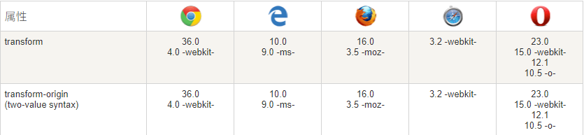
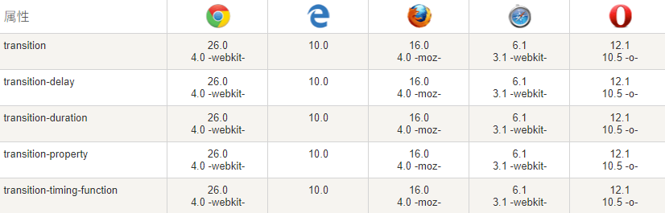

# css3属性

## 圆角(border-radius)

4 左上，右上，右下，左下

3 左上，右下\左上，右下

2 左上右下，右上左下

顺时针

两个值加斜杠/:水平和竖直

1到8个值

水平的改变/竖直的改变

border-radius: 1-4 length|% / 1-4 length|%

遵循顺时针

## 文本阴影(text-shadow)

四个值：0 0 0 color;水平位置，垂直位置，模糊度（不能是负值，可省略）颜色。

color：transparent文字透明

-webkit-text-stroke: 1px #fff;文字描边

## 盒阴影(box-shadow)

box-shadow：0 0 0 0 color;

水平移动 垂直移动 模糊度 阴影外延（可以省略）

box-shadow: inset 内阴影

颜色可以在前面或后面，inset也可以。但是，放在前面inset要在最前面（inset color 0 0 0 0），在后面的inset一定要在最后（0 0 0 0 color inset）

## 背景图(background-size)

只有一个值，另外一个会默认auto

第一个水平，第二垂直

cover等比例放到覆盖容器，背景图可能超出容器

contain将背景图像等比例缩放到宽度或高度与容器的宽度或高度相等，背景图像始终被包括在容器内

### 背景切割

background-clip:

border-box：从border开始背景色的覆盖。（图片的话从padding开始）

padding-box：从padding开始背景色覆盖（可用背景图）

content-box：从width开始覆盖（可用背景图）

### 背景原点

背景图起始点（只对背景图有效）

background-origin: border-box | padding-box | content-box;

## 半透明兼容问题（会导致文字透明）

background：blue

filter：alpha（opacity=50）；取值0~100

opacity：0.5；取值0~1

如果需要背景图半透明，文字不透明可以选用background-color: rgba(red, green, blue, alpha)这个写法

## 2D转换

兼容性



translate()方法，根据左(X轴)和顶部(Y轴)位置给定的参数，从当前元素位置移动。

```css
div {
  transform: translate(50px, 100px);
  -ms-transform: translate(50px, 100px); /* IE 9 */
  -webkit-transform: translate(50px, 100px); /* Safari and Chrome */
}
```

rotate()方法，在一个给定度数顺时针旋转的元素。负值是允许的，这样是元素逆时针旋转。

```css
div {
  transform: rotate(30deg);
  -ms-transform: rotate(30deg); /* IE 9 */
  -webkit-transform: rotate(30deg); /* Safari and Chrome */
}
```

scale()方法，该元素增加或减少的大小，取决于宽度（X轴）和高度（Y轴）的参数：

```css
div {
  -ms-transform:scale(2, 3); /* IE 9 */
  -webkit-transform: scale(2, 3); /* Safari */
  transform: scale(2, 3); /* 标准语法 */
}
```

skew() 方法，包含两个参数值，分别表示X轴和Y轴倾斜的角度，如果第二个参数为空，则默认为0，参数为负表示向相反方向倾斜。

skewX(&lt;angle&gt;);表示只在X轴(水平方向)倾斜。

skewY(&lt;angle&gt;);表示只在Y轴(垂直方向)倾斜。

```css
div {
  transform: skew(30deg, 20deg);
  -ms-transform: skew(30deg, 20deg); /* IE 9 */
  -webkit-transform: skew(30deg, 20deg); /* Safari and Chrome */
}
```

matrix()方法和2D变换方法合并成一个。

matrix 方法有六个参数，包含旋转，缩放，移动（平移）和倾斜功能

```css
div {
  transform:matrix(0.866, 0.5, -0.5, 0.866, 0, 0);
  -ms-transform:matrix(0.866, 0.5, -0.5, 0.866, 0, 0); /* IE 9 */
  -webkit-transform:matrix(0.866, 0.5, -0.5, 0.866, 0, 0); /* Safari and Chrome */
}
```

## 3D转换

|函数|描述|
|-|-|
|translate3d(x, y, z)|定义 3D 转化。|
|scale3d(x, y, z)|定义 3D 缩放转换。|
|rotate3d(x, y, z, angle)|定义 3D 旋转|
|perspective(n)|定义 3D 转换元素的透视视图。|

## 过渡

添加某种效果可以从一种样式转变到另一个的时候



过渡属性

|属性|描述|
|-|-|
|transition|简写属性，用于在一个属性中设置四个过渡属性。|
|transition-property|规定应用过渡的 CSS 属性的名称。|
|transition-duration|定义过渡效果花费的时间。默认是 0。|
|transition-timing-function|规定过渡效果的时间曲线。默认是 "ease"|
|transition-delay|规定过渡效果何时开始。默认是 0。|

```css
div {
  transition-property: width;
  transition-duration: 1s;
  transition-timing-function: linear;
  transition-delay: 2s;
  /* Safari */
  -webkit-transition-property:width;
  -webkit-transition-duration:1s;
  -webkit-transition-timing-function:linear;
  -webkit-transition-delay:2s;
}
/* 若一开始没有指定宽度，则宽度从0开始*/

/* 简写 */
div {
  transition: width 1s linear 2s;
  /* Safari */
  -webkit-transition:width 1s linear 2s;
}
```

## 动画

动画是使元素从一种样式逐渐变化为另一种样式的效果。

可以改变任意多的样式任意多的次数。

用百分比来规定变化发生的时间，或用关键词 "from" 和 "to"，等同于 0% 和 100%。

0% 是动画的开始，100% 是动画的完成。

最佳的浏览器支持，您应该始终定义 0% 和 100% 选择器

```css
@keyframes ani {
  from {background: red;}
  to {background: yellow;}
}
@-webkit-keyframes ani /* Safari 与 Chrome */
{
  from {background: red;}
  to {background: yellow;}
}
div {
  animation: ani 5s;
  -webkit-animation: ani 5s; /* Safari 与 Chrome */
}
```

|属性|描述|
|-|-|
|@keyframes|规定动画。|
|animation|所有动画属性的简写属性，除了 animation-play-state 属性。|
|animation-name|规定 @keyframes 动画的名称。|
|animation-duration|规定动画完成一个周期所花费的秒或毫秒。默认是 0。|
|animation-timing-function|规定动画的速度曲线。默认是 "ease"。|
|animation-fill-mode|规定当动画不播放时（当动画完成时，或当动画有一个延迟未开始播放时），要应用到元素的样式。|
|animation-delay|规定动画何时开始。默认是 0。|
|animation-iteration-count|规定动画被播放的次数。默认是 1。|
|animation-direction|规定动画是否在下一周期逆向地播放。默认是 "normal"。|
|animation-play-state|规定动画是否正在运行或暂停。默认是 "running"|

```css
div {
  animation-name: ani;
  animation-duration: 5s;
  animation-timing-function: linear;
  animation-delay: 2s;
  animation-iteration-count: infinite;
  animation-direction: alternate;
  animation-play-state: running;
  /* Safari 与 Chrome: */
  -webkit-animation-name: ani;
  -webkit-animation-duration: 5s;
  -webkit-animation-timing-function: linear;
  -webkit-animation-delay: 2s;
  -webkit-animation-iteration-count: infinite;
  -webkit-animation-direction: alternate;
  -webkit-animation-play-state: running;
}
/*简写*/
div {
  animation: myfirst 5s linear 2s infinite alternate;
  /* Safari 与 Chrome: */
  -webkit-animation: myfirst 5s linear 2s infinite alternate;
}
```

## 过渡和动画

1. 过度不能自行触发，通过hover等动作，或者JavaScript来进行会促发，动画可以自行运行
2. 过度可控性相对较弱，只能指定其实状态和结束状态，而动画可以定义多个关键帧
3. 动画多了两个参数，循环和关键帧名字
4. 动画运动之后，需要放回到初始状态
5. 过度的作用平滑改变css的值