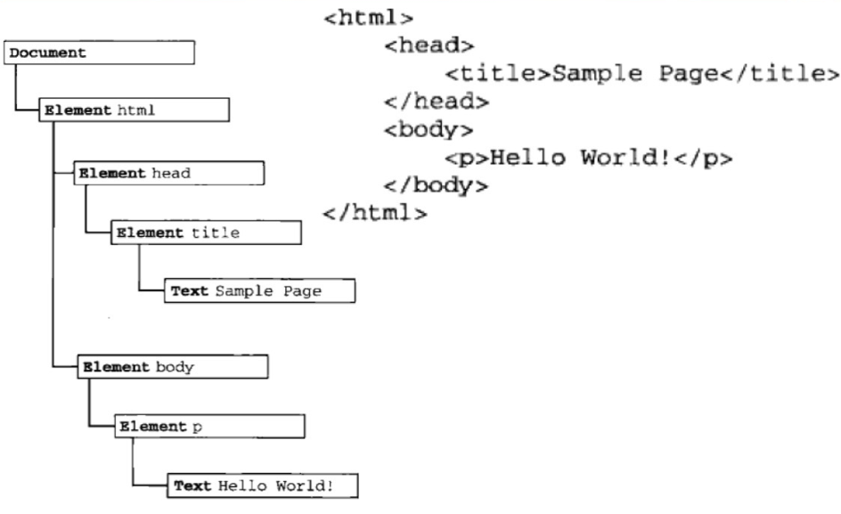

# DOM对象

DOM是针对HTML和XML文档中的一个API（应用程序编程接口）。DOM描绘了一个层次化的节点树，允许开发人员添加、移除、修改页面的魔某一部分。



标签属于结点的一种

结点是包含了标签，注释，文本，doctype等在内的多种组合。

nodeType属性：用于表明结点的类型。

标签结点：可以使用nodeName查看标签名称

文本结点：回车就是文本结点

注释结点：<-->

文档碎片结点

childNodes返回的是一个数组

body第一个结点是回车

```html
<div id='wrap'></div>
<script type='text/javascript'>
// 创建一个结点
var wrap = document.getElementById('wrap');
wrap.appendChild('span')
</script>
```

## 获取所有标签

```js
var  tss = getElementsByClassName("ts");
function getElementsByClassName(className) {
  var elements = document.getElementsByTagName("*");
  var arr = [];
  for(var i = 0; i < elements.length; i++){
    if (elements[i].className == className) {
      arr.push(elements[i]);
    }
  }
  return arr;
}
console.log(tss);

// document.all获取所有标签
// google数组
// ie对象
```

## 结点的复制

cloneNode（true/false）

深复制true，父及包括子集。

浅复制false，只有父。

默认false

## 替换标签

id.replaceChild(新便签，旧标签)

## 获取一些属性和值

id.getAttribute("type");得到属性值

id.setAttribute("type", "file");设置属性值

id.removeAttribute(name);删除结点的name

innerHTML:获取标签里面的

innerText：获取需要能显示的

outerText：同上

innerOuter：获取本身及标签里面的