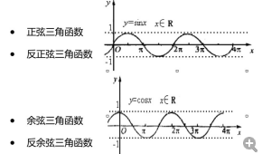

# Math方法

## PI

```js
Math.PI
```

## 随机数

Math.random（）;取值范围[0, 1)大于等于0小于1

```js
Math.random()

// 1到30
// 1 <= parseInt(Math.random() *30 +1 ) <=30
// 取整数
// 39 <= Math.radom() <=99
Math.ceil(Math.random * 60 +39)
```

Math.random()的取值应该是0-1（事实上取不到0和1）之间的随机小数，

乘以8之后应该是0-8之间的随机小数，也就是0.****到7.****之间的小数（大于0而小于8），经过int类型转换之后，应该是0-7之间的随机整数，所以"+1"之后就会得到1－8之间的

## 舍入取整方法

ceil，向上取整（整数就是本身）
floor，向下取整
round，四舍五入最近整数；

## 取数组中的最大值和最小值

Math.max(放需要比较的数字，用逗号隔开)

Math.min()

```js
var arr = [11, 13, 7, 3, 4, 6, 10];
var max = arr[0];
var min = arr[0];
for (var i = 1; i <= arr.length; i++){
  if (max < arr[i]) {
      max = arr[i];
  }
  if (min > arr[i]){
      min = arr[i]
  }
}
console.log(max);
console.log(min);
```

## 三角函数



```js
sin(0); // 0
sin(Math.PI / 2); // 1
sin(Math.PI); // 接近0
cos(0); // 1
cos(Math.PI / 2); // 接近0
cos(Math.PI); // -1
```

## 次幂

```js
Math.pow(x, y);
// x 的 y 次幂
```

## 算术平方根

```js
Math.sqrt(9);
```

## 构造函数

new 构造函数实例化

获得当前计算机时间

```js
var date = new Date();必须先获取时间
//年
date.getFullYear();
//月数值0~11;
date.getMonth();
//日
date.getDate();
//今天周几（0~6）
date.getDay();
//小时
date.getHours();
//分
date.getMinutes();
//秒
date.getSeconds();
//毫秒
date.getMilliseconds();
// 获取国际时间是UTC
date.getUTCMillisecond(); // 本初子午线时间
// 不能是date.getUTCyear（）；
date.getTime(); // 获取某个时间到现在的毫秒熟；
// 修改时间：
date.setFullYear(2013);
date.setMonth(0);
date.setDate(1);
date.setHours(0);
date.setMinutes(0);
date.setSeconds(0);
date.setMillseconds(0);
date.setDay(); // 报错
date.setUTCTime(); // 报错
date.setUTCDay(); // 报错
date.setUTCYear(); // 报错
```

## 生成随机数

```js

/*
* [differentRandom 生成不重复的随机数]
* @param  {[字符串]} len [要产生的随机数个数]
* @param  {[字符串]} x，y  [控制范围 y ~ x+y-1]
* @demo var arr =  differentRandom(5, 20, 5);
*/
function differentRandom(len, x, y) {
  var arr = [];
  var num;
  for (var i = 0; i < len; i++) {
   num = Math.floor(Math.random() * x + y);
   for (var j = 0; j < arr.length; j++) {
     if (num == arr[j]) {
        num = Math.floor(Math.random() * x + y);
        j = -1;
     }
   }
   arr.push(num);
  }
  return arr;
}
var arr =  differentRandom(5, 20, 5);
console.log(arr);

/*
* [noRepeatRandom 生成不重复的随机数]
* @param  {[字符串]} start [范围起始值]
* @param  {[字符串]} end   [范围终止值]
* @return {[对象]}  count   [要产生的随机数个数]
* @demo var arr =  noRepeatRandom(1, 10, 5) ;
*/

function noRepeatRandom(start, end, count) {
  var arrRange = [];
  var arrResult = [];
  var arr = [];
  for (var i = start; i <= end; i++ ) {
    arrRange.push(i);
  }
  var len = arrRange.length;
  for (var j = 0; j < count; j++) {
    var num = Math.floor(Math.random() * len);
    // splice() 方法可删除从 index 处开始的零个或多个元素，并且用参数列表中声明的一个或多个值来替换那些被删除的元素。
    // 如果从 arrayObject 中删除了元素，则返回的是含有被删除的元素的数组。1
    arrResult.push(arrRange.splice(num, 1)[0]);
    len--;1
  }
  return arrResult;
}
var arr1 =  noRepeatRandom(0, 2, 3);
console.log(arr1);
```

## 圆周运动

```html
<!DOCTYPE html>
<html>
<head>
<meta charset = "utf-8">
<title>圆周运动</title>
<style>
      body {
            position: relative;
      }
      .box {
            position: absolute;
            top: 300px;
            left: 630px;
            width: 100px;
            height: 100px;
            background-color: red;
            border-radius: 50px;
      }
      input[type="button"] {
            position: absolute;
            top: 20px;
            left: 660px;
            width: 50px;
            height: 25px;
      }
      input[type="text"] {
            position: absolute;
            top: 60px;
            left: 590px;
            width: 200px;
            height: 25px;
      }
</style>
</head>
<body>
<input type="button" id="button" value="开始">
<input type="text" id="number" value="0">
<div class="box" id="box"></div>
<script type="text/javascript">
      var box = document.getElementById("box");
      var num = document.getElementById("number");
      var btn = document.getElementById("button");
      var timer = null;
      var step = 1;
      var radius = 0;
      var number = false;
      btn.onclick = function(){
            if(num.value == 0){
                  radius = 100;
            }else {
                  radius = num.value;
            }
            show(radius);
      }
      function show(bigRadius){
            if(timer){
                  clearInterval(timer);
            }
            timer = setInterval(function(){
                  if(step == 360){
                        step = 1;//角度
                  }
                  box.style.left = 630 + bigRadius * Math.cos(Math.PI / 180 * step) + "px";
                  box.style.top = 300 + bigRadius * Math.sin(Math.PI / 180 * step) + "px";
                  step += 2;
            }, 20);
      }
</script>
</body>
</html>
```