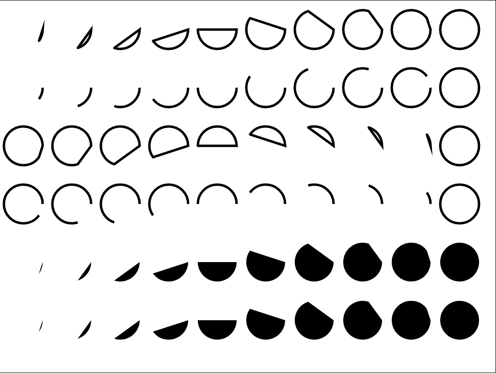

# canvas-圆形绘制

```html
<!DOCTYPE html>
<html lang="en">
  <head>
    <meta charset="utf-8">
    <link rel="stylesheet" type="text/css" href="../css/reset.css" />
    <style type="text/css">
      .canvas-wrap {
        display: block;
        margin: 20px auto 0;
        border: 1px solid #000;
      }
    </style>
  </head>
  <body>
    <canvas id="canvas" width="1024" height="768" class="canvas-wrap"></canvas>
  </body>
  <script type="text/javascript">
    window.onload = function(){
      var canvas = document.getElementById("canvas");
      var context = canvas.getContext("2d");
      context.lineWidth = 5;
      context.strokeStyle = "#000";
      //圆心x的位置，圆心y的位置，半径，开始角度，结束角度，顺时针逆时针
      // context.arc(300, 300, 200, 0, 1.5*Math.PI, false);
      // context.stroke();
      for (var i = 0; i < 10; i++) {
        context.beginPath();
        context.arc(50+i*100, 60, 40, 0, 2*Math.PI*((i+1)/10), false);
        context.closePath();
        context.stroke();
      };
      for (var i = 0; i < 10; i++) {
        context.beginPath();
        context.arc(50+i*100, 180, 40, 0, 2*Math.PI*((i+1)/10), false);
        context.stroke();
      };
      for (var i = 0; i < 10; i++) {
        context.beginPath();
        context.arc(50+i*100, 300, 40, 0, 2*Math.PI*((i+1)/10), true);
        context.closePath();
        context.stroke();
      };
      for (var i = 0; i < 10; i++) {
        context.beginPath();
        context.arc(50+i*100, 420, 40, 0, 2*Math.PI*((i+1)/10), true);
        context.stroke();
      };
      context.fillStyle = "#000";
      for (var i = 0; i < 10; i++) {
        context.beginPath();
        context.arc(50+i*100, 540, 40, 0, 2*Math.PI*((i+1)/10), false);
        context.closePath();
        context.fill();
      };
      for (var i = 0; i < 10; i++) {
        context.beginPath();
        context.arc(50+i*100, 660, 40, 0, 2*Math.PI*((i+1)/10), false);
          context.fill();
      };
      // 上下两个for循环差别在是否有结束的close.Path();它会告诉画笔是否需要封闭这个图形；
    }
  </script>
</html>
```

