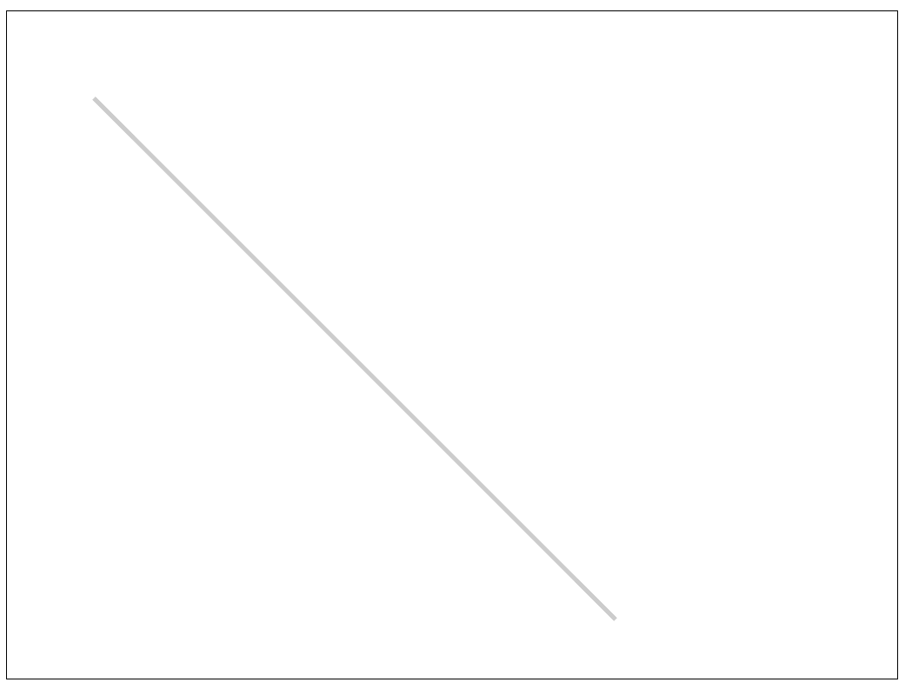
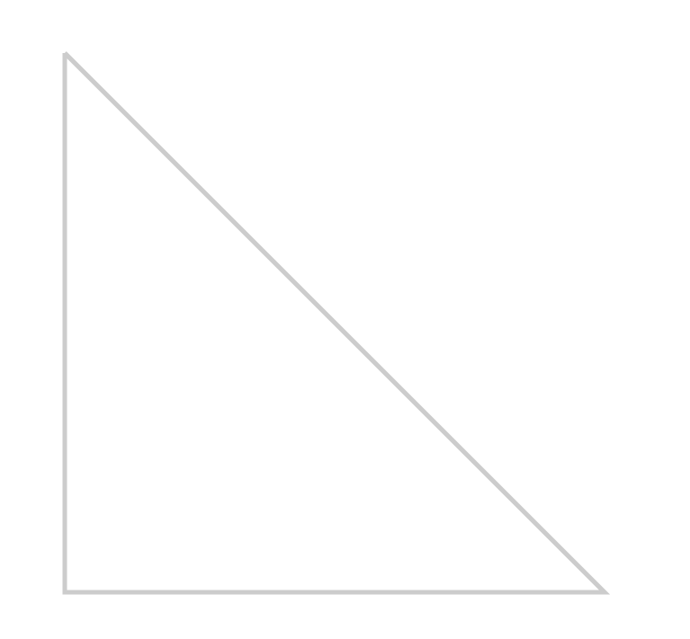
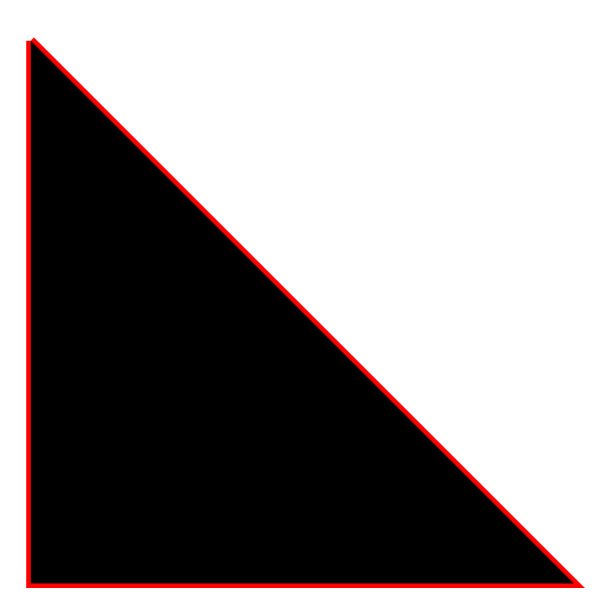
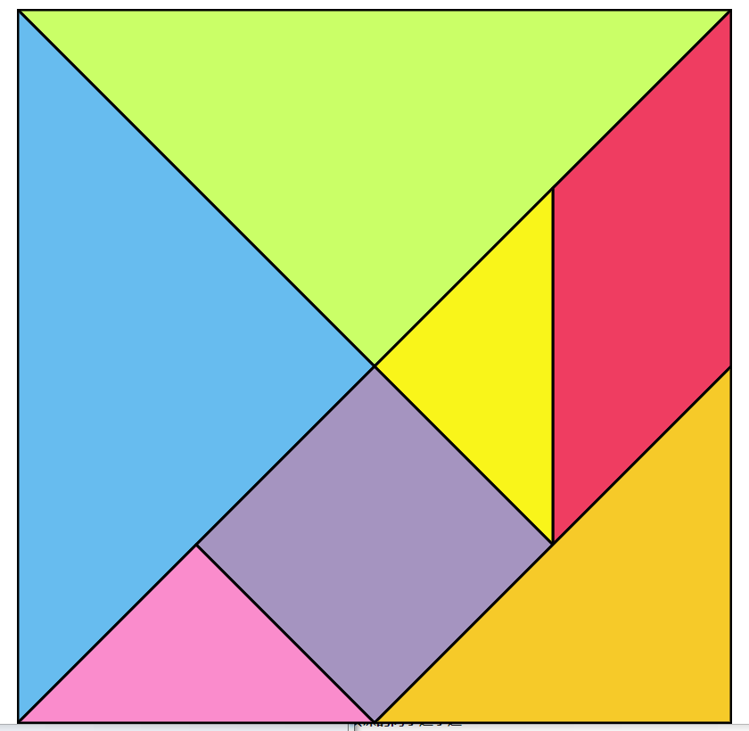

# canvas

## 初始化一个canvas

```html
<!DOCTYPE html>
<html lang="en">
  <head>
    <meta charset="utf-8">
    <link rel="stylesheet" type="text/css" href="../css/reset.css" />
    <link rel="stylesheet" type="text/css" href="../css/index.css" />
  </head>
  <body>
    <canvas id="canvas" width="1024" height="768" class="canvas-wrap"></canvas>
  </body>
  <script type="text/javascript">
    window.onload = function(){
      var canvas = document.getElementById("canvas");
      var context = canvas.getContext("2d");
    }
  </script>
</html>
```

## 设置canvas的大小

### HTML标签内写入宽高

```html
<canvas id="canvas" width="1024" height="768" class="canvas-wrap"></canvas>
```

注意不需要单位，不推荐使用css的方法进行写入，因为css只是告诉你画布的大小，而不是分辨率

### 画布中调用canvas的属性设置画布的大小

```js
var canvas = document.getElementById("canvas");
canvas.width = 1024;
canvas.height = 768;
```

## canvas兼容性处理

### HTML标签内写入

```html
<!--可以直接在html标签<canvas></canvas>写入-->
<canvas>当前浏览器不支持canvas</canvas>
```

### 画布中调用canvas的属性判断是否兼容

```js
if(canvas.getContext("2d")) {
  var context = canvas.getContext("2d");
}else {
  alert("当前浏览器不支持canvas ");
}
```

## 绘制图形

canvas的绘图是一个状态的绘图，指定初始状态和结束状态

### 绘制一条横线

```js
  // 横线的起点位置
  context.moveTo(100, 100);
  // 横线的终点位置
  context.lineTo(700, 700);
  //横线的宽度
  context.lineWidth = 5;
  //横线颜色,要用字符串的颜色
  context.strokeStyle = "#ccc";
  //状态为划
  context.stroke();

// 如果需要多个线条，只需要增加lineto
  context.lineTo(100,700);
  context.lineTo(100,100);

// 颜色填充；
  context.fillStyle = "#000";
  context.fill();
```







### 绘制一个七巧板

```html
<!DOCTYPE html>
<html lang="en">
  <head>
    <meta charset="utf-8">
    <style>
      .canvas-wrap {
        display: block;
        margin: 20px auto 0;
        border: 1px solid #000;
      }
    </style>
  </head>
  <body>
    <canvas id="canvas2" width="800" height="800" class="canvas-wrap"></canvas>
  </body>
  <script type="text/javascript">
    window.onload = function(){
      var tangram = [{p:[{x:0,y:0},{x:800,y:0},{x:400,y:400}],color:"#caff67"},//类的对象
                {p:[{x:0,y:0},{x:400,y:400},{x:0,y:800}],color:"#67bcef"},
                {p:[{x:800,y:0},{x:800,y:400},{x:600,y:600},{x:600,y:200}],color:"#ef3d61"},
                {p:[{x:600,y:200},{x:600,y:600},{x:400,y:400}],color:"#f9f51a"},
                {p:[{x:400,y:400},{x:600,y:600},{x:400,y:800},{x:200,y:600}],color:"#a594c0"},
                {p:[{x:200,y:600},{x:400,y:800},{x:0,y:800}],color:"#fa8ccc"},
                {p:[{x:800,y:400},{x:800,y:800},{x:400,y:800}],color:"#f6ca29"}];
      var qiqiao = document.getElementById('canvas2');
      var context2 = qiqiao.getContext("2d");
      for (var i = 0; i <= tangram.length; i++) {
        draw(tangram[i],context2);
      };
      function draw(piece, con){
        con.beginPath();
        con.moveTo(piece.p[0].x,piece.p[0].y);
        for(var i = 1; i< piece.p.length;i++){
          con.lineTo(piece.p[i].x,piece.p[i].y);
        };
        con.closePath();
        con.fillStyle = piece.color;
        con.fill();
        con.lineWidth = 3;
        con.strokeStyle = "black";
        con.stroke();
      };
    };
  </script>
</html>
```



这里有个小注意：如果说先画线段，stroke，在进行fill填充的话：填充色会覆盖线段的一半。也就是边宽变成1.5，为了避免，所以我们先填充再进行线段的绘制

```js
con.lineCap =  miter(defualt) 尖角
con.lineCap =  miter(bevel) 折叠
con.lineCap =  miter(round) 圆角
```

只在线段的头和尾起作用，折角出不会出现效果，使用close.path()也不会有用；