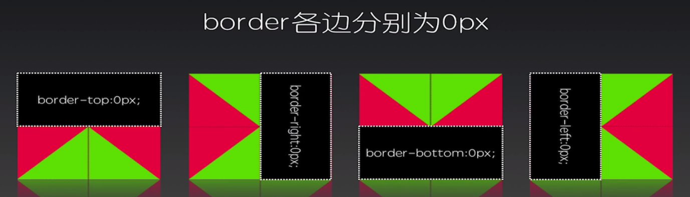
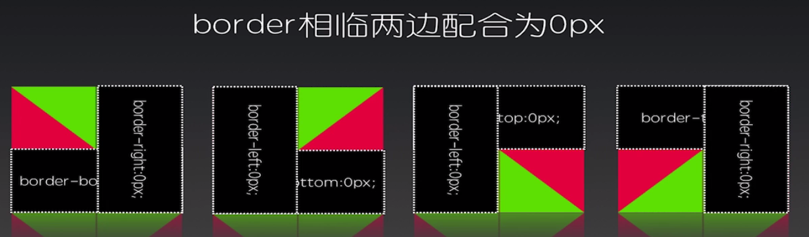

# css技巧-三角形

```html
<!DOCTYPE html>
<html lang="en">
  <head>
    <meta charset="utf-8">
    <style type="text/css">
      .pink {
        width: 0;
        height: 0;
        border-bottom: 100px solid blue;
        border-right: 100px solid red;
        border-left: 100px solid red;
        border-top: 100px solid blue;
      }
      .red {
        background: red;
      }
      .black {
        background: #000;
      }
    </style>
  </head>
  <body>
    <div class="pink"></div>
    <div class="red"></div>
    <div class="black"></div>
  </body>
</html>
```



