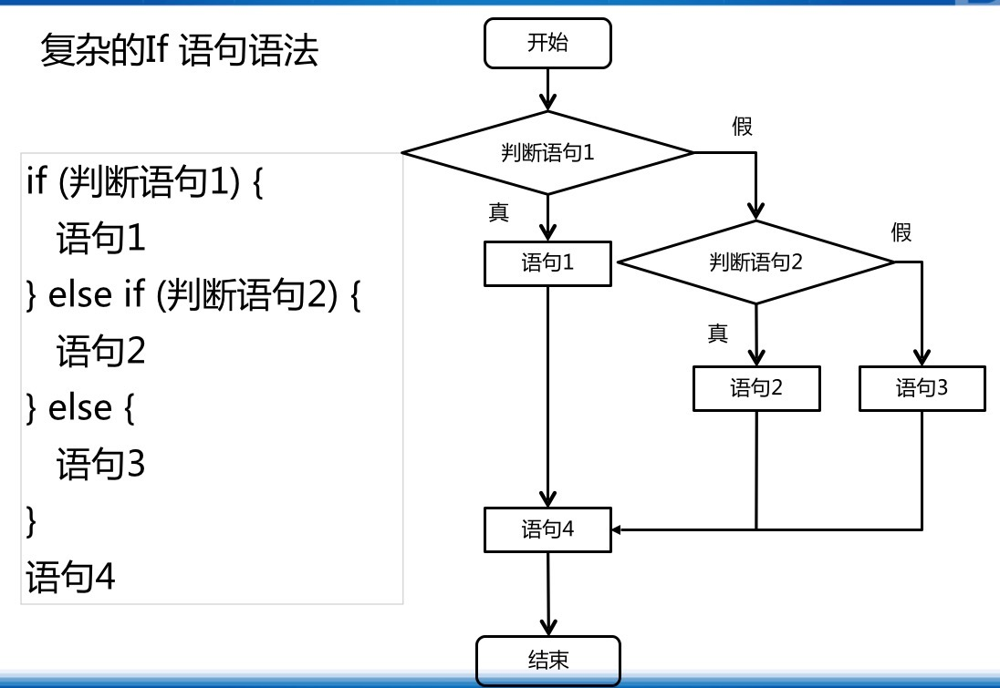
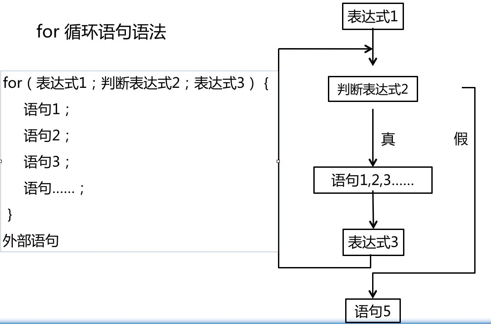
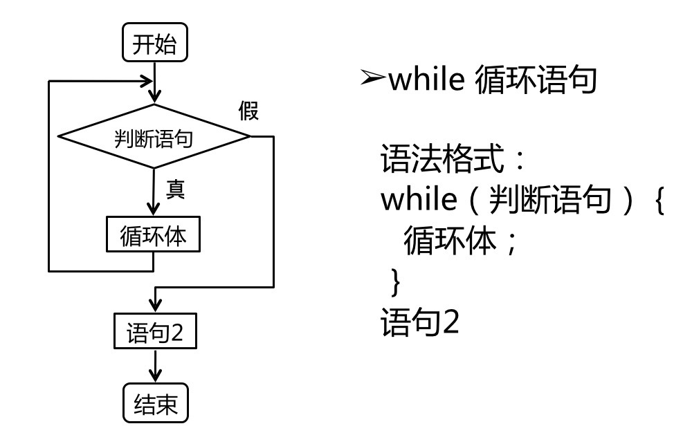

# if语句和循环语句

## if

```js
if () {
  ...
} else {
  ...
}
```



else与if的配对原则：else与其之上的没有else配对的if配对，else的数量永远小于或等于if的数量

## for

for循环的使用情况：数量方面有一定的范围限制，为多个类似或同一类型的标签添加同样的或有规律的动作
for（初始化；判断条件；递增语句）{}三个条件都可以少，但是;不能少

```js
for (var i = 0; i < length; i ++) {

}
```



```js
// 案例1
var sum = 0;
for (var i = 1 ; i < 100 ; i++) {
  if  (i % 3 == 0) {
    sum = sum + i;
  } else {
    sum = sum + 1;
  }
}
console.log(sum);

// 案例2
var sum = 0;
for (var i = 1;i <= 9;i ++){
  for (var j = 1; j <= 9; j++) {
    sum = i*j +sum
  }
}
console.log(sum);

// 案例3
var i = 0;
for (;;) {
  if (i >= 10) {
    // 跳出循环
    break
  }
  console.log(i)
  i++;
}

// 案例4
for (var i = 0; i < 10: i++) {
  if (i === 5) {
    // 跳出当前循环，继续下次循环
    continue
  }
  console.log(i)
}
```

## while



## switch

```js
switch
var x = 7;
switch(x) {
  case 1: console.log("one");
          break;
  case 2: console.log("two");
          break;
  case 3: console.log("three");
          break;
  case 4: console.log("four");
          break;
  case 5: console.log("fine");
          break;
  case 6: console.log("six");
          break;
  default: console.log('seven');
}
```