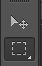

# 有关PS技巧，和切图

## 页面重构

由美工的PSD图转化而来的HTML代码的网页图。

## 精确度

对于设计图的还原度最少要达到百分之90。

## 背景图（icon）和数据图

背景图（icon）：一直不变的图，例如小图标；

数据图：每次打开都有可能不一样的图，例如淘宝首页的广告区。

## 颜色

颜色由十六进制数组成，三基色：红绿蓝（red，green，blue）。
例如#ffffff白色，#ff0000红色，#00ff00绿色，#0000ff蓝色，#000000黑色。
彩虹色：红橙黄绿青蓝紫，
对于颜色的描述：颜色值，亮度（深浅度）。

## ps篇

提取图层。

rgb为显示屏颜色

cmyk为打印模式

保存的方法：

1. 存储ctrl+s（psd格式文件），
2. 存储为（另存为）ctrl+shift+s（其他格式），
3. 存储为web所用格式ctrl+shift+alt+s。

## JPG PNG GIF 区别

动画：GIF支持，PNG、JPG不支持动画。

透明：PNG支持半透明，JPG、GIF不支持半透明，GIF和PNG支持全透明，JPG不支持透明
png-8（支持全透明， 不支持半透明，不支持动画，色彩处理程度比GIF高） gif png-24。

文件大小：jpg的压缩率较大。

兼容性：ie6浏览器不支持png-24的透明，如果没有动画，一般选择PNG-8格式的图片。

## 常用快捷键

1. 空格：抓手工具；
2. 参考线：ctrl+；
3. 切片工具；；
4. 选区：按住CTRL将鼠标移至图层可进行选区，ctrl+d取消选区；
5. 单位选择：菜单栏-编辑中-首选项-可以选择文字和标尺的像素；
6. 测量：矩形选区工具，空格小技巧；
7. 填充颜色：ctrl+delete背景色，ALT+delete前景色；
8. 标尺：ctrl+R。