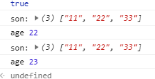
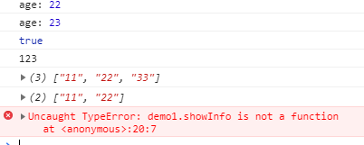
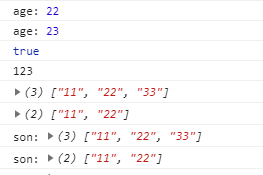

# 原型链

层层指向父原型的关系，可以用来查找对象之间的继承关系

三种方式

1. 简单继承
2. 借用构造函数继承
3. 组合模式的继承

## 简单继承

```js
  // 父类
  function Parent() {
    this.name = "123";
    this.friends = ["11", "22"];
  }
  Parent.prototype.showInfo = function() {
    console.log('parent:', this.friends);
  }
  // 子类
  function Son(age) {
    this.age = age;
  }
  // 继承
  // 子级的原型对象被父级的实例覆盖
  Son.prototype = new Parent();
  Son.prototype.showInfo = function() {
    console.log('son:', this.friends);
    console.log('age:', this.age)
  }
  //查找自己,往上以及查找原型对象，依次类推（作用域链一样）
  var demo1 = new Son(22);
  var demo2 = new Son(23);
  demo1.friends.push("33");
  console.log(demo1.showInfo == demo2.showInfo);
  demo1.showInfo();
  demo2.showInfo();
  // 不足之处：
  // 1、修改引用类型属性会影响到每个实例相应的属性（对象之间互相影响）
  // 2、子类创建的实例对象无法给父类的构造函数传递参数，导致每个实例的父类属性一样。
  // 优点
  // 1、方法的继承，共同使用同一个方法，每个实例公用同一个地址的方法
```



## 用构造函数实现继承

```js
function Parent() {
  this.name = "123";
  this.friends = ["11", "22"];
}
Parent.prototype.showInfo = function() {
  console.log('parent:', this.friends);
}
function Son(age) {
  Parent.call(this);
  this.age = age;
  console.log('age:', this.age)
}
var demo1 = new Son(22);
var demo2 = new Son(23);
demo1.friends.push("33");
console.log(demo1.showInfo == demo2.showInfo);
console.log(demo1.name); // 属性继承
console.log(demo1.friends);
console.log(demo2.friends);
demo1.showInfo(); // 报错 // 方法无法继承
demo2.showInfo(); // 报错
// 子类无法调用父类的方法，（方法无法继承）
// 如果要实现继承
// 如果方法要实现继承，需要放置够着函数当众，方法内存空间没有得到优化
// 优点，实现属性的继承（对象属性质检互不影响）
```



## 组合继承又名“伪经典继承”

通过构造函数实现对实例属性的继承

利用call循环的方法实现属性的继承，

利用for_in循环，用原型链继承的方法继承原来的所有方法。实现重写

```js
function Parent() {
  this.name = '123';
  this.friends = ['11', '22'];
};
Parent.prototype.showInfo = function() {
  console.log('parent:', this.friend);
};
function Son(age) {
  // 属性继承
  Parent.call(this);
  this.age = age;
  console.log('age:', this.age);
};
// 方法的继承
for (let i in Parent.prototype) {
  Son.prototype[i] = Parent.prototype[i];
};
Son.prototype.showInfo = function() {
  console.log('son:', this.friends);
};
var demo1 = new Son(22);
var demo2 = new Son(23);
demo1.friends.push('33');
console.log(demo1.showInfo == demo2.showInfo);
console.log(demo1.name);
console.log(demo1.friends);
console.log(demo2.friends);
demo1.showInfo();
demo2.showInfo();
```



## 触壁反弹

```html
<!doctype html>
<html>
<head>
  <meta charset="UTF-8">
  <style>
    .wrap {
      position: relative;
      width: 800px;
      height: 400px;
      margin: 50px auto;
      border: 1px solid #f00;
    }
    .wrap div {
      position: absolute;
      width: 50px;
      height: 50px;
      background: #999;
    }
  </style>
</head>
<body>
  <div class="wrap" id="main">
  </div>
  <script>
    function Bounce(ParentId){
      var _this = this;
      this.main = document.getElementById(ParentId);
      this.box = document.createElement('div');
      this.main.appendChild(this.box);
      this.posX = Math.ceil(Math.random()*600+50);
      this.posY = Math.ceil(Math.random()*300+50);
      this.speed = 1;
      this.moveX = true;
      this.moveY = true;
      this.pos();
      this.timer = setInterval(function(){
        _this.move();
      }, 16);
    }
    /*
      * JS页面初始化 浮动块的位置
      */
    Bounce.prototype.pos = function(){		
      this.box.style.top = this.posY + "px";
      this.box.style.left = this.posX + "px";
    }
    /*
      * 功能：通过对left和top的修改，实现运动
      * 通过修改moveX和moveY控制运动的方向
      * 碰壁反弹
      */
    Bounce.prototype.move = function(){
      // 水平方向
      if (this.moveX) {
        this.posX += this.speed;
        if (this.posX >= this.main.clientWidth - this.box.offsetWidth) {
          this.moveX = false;
        };
      } else {
        this.posX -= this.speed;
        if (this.posX <= 0) {
          this.moveX = true;
        };
      }

      // 垂直方向
      if (this.moveY) {
        this.posY += this.speed;
        if (this.posY >= this.main.clientHeight - this.box.offsetHeight) {
          this.moveY = false;
        };
      } else {
        this.posY -= this.speed;
        if (this.posY <= 0) {
          this.moveY = true;
        };
      }

      this.rePos();
    }

    Bounce.prototype.rePos = function(){
      // 赋值
      this.box.style.left = this.posX + 'px';
      this.box.style.top = this.posY + 'px';
    }


    // for (var i = 0; i < 10; i++) {
    // 	var newBall = new Bounce('main');
    // };


    // 随机位置的球球 继承原有属性
    function RanPosBall(ParentId){
      Bounce.call(this, ParentId);
      // 增加三种随机颜色
      this.colorR = Math.round(Math.random()*255);
      this.colorG = Math.round(Math.random()*255);
      this.colorB = Math.round(Math.random()*255);
      // 重写速度属性
      this.speed = Math.round(Math.random()*3+1);
      this.moveX =  Math.round(Math.random()*1);
      this.moveY =  Math.round(Math.random()*1);
      if (this.moveX == 1) {
        this.moveX = true;
      } else {
        this.moveX = false;
      }
      if (this.moveY == 1) {
        this.moveY = true;
      } else {
        this.moveY = false;
      }
      this.pos();
    }
    for(var i in Bounce.prototype) {
      RanPosBall.prototype[i] = Bounce.prototype[i];
    }
    // 重写pos初始化方法，增加颜色变化
    RanPosBall.prototype.pos = function(){
      this.box.style.top = this.posY + "px";
      this.box.style.left = this.posX + "px";
      this.box.style.backgroundColor = "rgb(" + this.colorR + ", " + this.colorG + ", " + this.colorB + ")";
      this.box.style.borderRadius = "50%";
    }
    for (var i = 0; i < 10; i++) {
      var newBall = new RanPosBall('main');
    };
  </script>
</body>
</html>
```