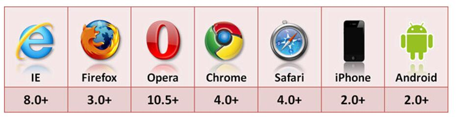

# 本地存储

本地存储：将一些数据存储到本地的技术

作用：记录用户的习惯，用户密码，用户名字，用户id，换肤。

本地存储：将一些数据存储到本地的技术
作用：记录用户的习惯，用户密码，用户名字，用户id，换肤。

cookie：是浏览器提供的一种机制，不是JavaScript本身的性质，而是把API接口体统给了JavaScript

当 web 服务器向浏览器发送 web 页面时，在连接关闭后，服务端不会记录用户的信息。

Cookie 的作用就是用于解决 "如何记录客户端的用户信息":

当用户访问 web 页面时，他的名字可以记录在 cookie 中。

在用户下一次访问该页面时，可以在 cookie 中读取用户访问记录。

注意：可以跨越一个域名下的多个页面，但是不能实现跨多个域名

```js
// 设置cookie
document.cookie = "哈哈";
//设置时间戳
//如何设置三天内有效
var day = 3 * 24 * 3600 * 1000;
var oldDay = new Date(day + new Date().getTime()).toGMTString();
document.cookie = "username=zhhihua;expires=" + oldDay;
// cookie的删除
var oldDay = new Date().toGMTString();
document.cookie = "username=zhhihua;expires=" + oldDay;
//默认情况下(不设置时间戳),用户关闭浏览器时会销毁cookie,这些cookie仅仅内存中.
```

使用 JavaScript 删除 Cookie

删除 cookie 非常简单。需要设置 expires 参数为以前的时间即可，如下所示，设置为 Thu, 01 Jan 1970 00:00:00 GMT:

```js
document.cookie = "username=; expires=Thu, 01 Jan 1970 00:00:00 GMT";
```

## 实例运用

```js
// 创建一个cookie值，并存值，和过期时间
function setCookie (cname, cvalue, exdays){
  var d = new Date();
  d.setTime(d.getTime() + (exdays * 24 * 60 * 60 * 1000));
  var expires = "expires=" + d.toGMTString();
    document.cookie = cname + "=" + cvalue + "; " + expires;
}
// 从cookie中取值
function getCookie (cname) {
  var name = cname + "=";
  var ca = document.cookie.split(';');
  for(var i = 0; i < ca.length; i++) {
    var c = ca[i].trim();
    if (c.indexOf(name) == 0) {
      return c.substring(name.length, c.length);
    }
  }
  return "";
}
// 检测cookie是否存在
function checkCookie () {
  var user = getCookie("username");
  if (user != ""){
    console.log("欢迎 " + user + " 再次访问");
  } else {
    user = prompt("请输入你的名字:","");
    if (user != "" && user != null){
      setCookie("username", user, 30);
    }
  }
}
```

## localStorage 方法

localStorage 方法存储的数据没有时间限制。第二天、第二周或下一年之后，数据依然可用。

```js
localStorage.lastname = "Smith";
document.write(localStorage.lastname);

if (localStorage.pagecount) {
  localStorage.pagecount = Number(localStorage.pagecount) + 1;
} else {
  localStorage.pagecount = 1;
}
document.write("Visits " + localStorage.pagecount + " time(s).");
```

## sessionStorage 方法

sessionStorage 方法针对一个 session 进行数据存储。当用户关闭浏览器窗口后，数据会被删除。

```js
if (sessionStorage.pagecount) {
  sessionStorage.pagecount = Number(sessionStorage.pagecount) + 1;
} else {
  sessionStorage.pagecount = 1;
}
document.write("Visits "+ sessionStorage.pagecount + " time(s) this session.");
```

