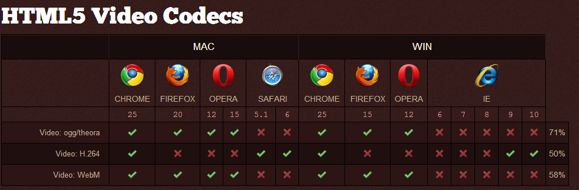
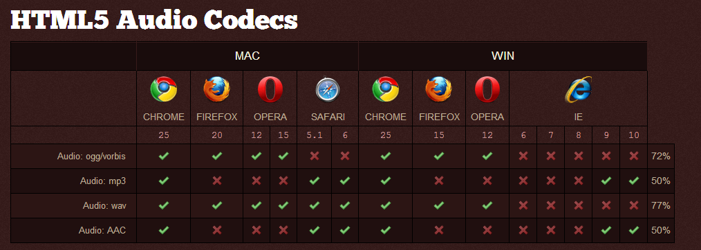

# 视频音频

## 视屏编码

theora，H.264，vp8

如果不支持这个编码格式可能出现有声音当时没有图像。(解决办法，转码)

HTML5支持的视频格式

Ogg = Theora + Vorbis;

MPEG64 = H.264 + AAC;

webM = vp8 + vorbis;



HTML5支持的音频格式

0gg

wav

mp3



## 标签属性

```html
<video controls='controls' preload='auto'></video>
```

## 方法

|方法|描述|
|-|-|
|load()|重新加载音频/视频元素|
|play()|开始播放音频/视频|
|pause()|暂停当前播放的音频/视频|

## 属性

|属性|描述|
|-|-|
|autoplay|设置或返回是否在加载完成后随即播放音频/视频|
|controller|返回表示音频/视频当前媒体控制器的 MediaController 对象|
|controls|设置或返回音频/视频是否显示控件（比如播放/暂停等）|
|currentTime|设置或返回音频/视频中的当前播放位置（以秒计）|
|duration|返回当前音频/视频的长度（以秒计）|
|ended|返回音频/视频的播放是否已结束|
|error|返回表示音频/视频错误状态的 MediaError 对象|
|loop|设置或返回音频/视频是否应在结束时重新播放|
|paused|设置或返回音频/视频是否暂停|
|played|返回表示音频/视频已播放部分的 TimeRanges 对象|
|preload|设置或返回音频/视频是否应该在页面加载后进行加载|
|canplay|当浏览器可以播放音频/视频时|
|durationchange|当音频/视频的时长已更改时|

## 实例

```html
<body>
  <div class="wrap">
    <video preload="auto" controls="controls" loop="loop">
      <source type="video/mp4" src="../media/media.mp4"/>
      <source type="video/Ogg" src="../media/media.ogv"/>
      <source type="video/webm" src="../media/media.webm"/>
    </video>
    <div class="play-btn clearfix">
      <span>切换视屏</span>
      <span>停止</span>
      <span>播放</span>
      <span>加速</span>
      <span>减速</span>
      <span>音量+</span>
      <span>音量—</span>
      <span>静音</span>
      <span>全屏</span>
    </div>
  </div>
  <script type="text/javascript">
    var btnArr = $(".play-btn span");
    var vid = $(".wrap video");
    var q = true;
    var srcArr = $(".wrap source");
    var a = 1;
    // 切换视屏
    btnArr.eq(0).click(function(event) {
      /*原理既是切换source标签里的属性*/
      if (q) {
        srcArr[0].src = "../advert/advert.mp4";
        srcArr[1].src = "../advert/advert.ogv";
        srcArr[2].src ="../advert/advert.webm";
        // 加载视屏
        vid[0].load();
        // 播放视屏
        vid[0].play();
        q = false;
      } else {
        srcArr[0].src = "../media/media.mp4";
        srcArr[1].src = "../media/media.ogv";
        srcArr[2].src ="../media/media.webm";
        // 加载视屏
        vid[0].load();
        // 播放视屏
        vid[0].play();
        q = true;
      }
    });
    // 暂停
    btnArr.eq(1).click(function(event) {
      vid[0].pause();
    });
    /*播放*/
    btnArr.eq(2).click(function(event) {
      vid[0].play();
    });
    // 加速播放
    // 有个最大值，各个浏览器不同
    btnArr.eq(3).click(function(event) {
      vid[0].playbackRate += 0.5;
    });
    // 减速播放
    // 有个最小值0
    btnArr.eq(4).click(function(event) {
      vid[0].playbackRate -= 0.5;
    });
    btnArr.eq(5).click(function(event) {
      vid[0].muted = false;
      if (vid[0].volume.toFixed(1) >= 1) {
        vid[0].volume = 1;  
      } else {
        vid[0].volume += 0.1;
        vid[0].volume = vid[0].volume.toFixed(1);
        console.log(vid[0].volume)
      };
    });
    btnArr.eq(6).click(function(event) {
      vid[0].muted = false;
      if (vid[0].volume.toFixed(1) <= 0) {
        a = 0;  
      } else {
        vid[0].volume -= 0.1;
        vid[0].volume = vid[0].volume.toFixed(1);
        console.log(vid[0].volume)
      };
    });
    //静音
    btnArr.eq(7).click(function(event) {
      if (vid[0].muted) {
        vid[0].muted = false;
      } else {
        vid[0].muted = true;
      }
    });
    btnArr.eq(8).click(function(event) {
      if (vid[0].webkitEnterFullScreen) {
        // 谷歌
        vid[0].webkitEnterFullScreen();
      } else {
        // 火狐
        vid[0].mozRequestFullScreen();
      }
    });

    vid[0].addEventListener("timeupdate", function(){
      console.log(vid[0].currentTime / vid[0].duration);
    }, false)
  </script>
</body>
```