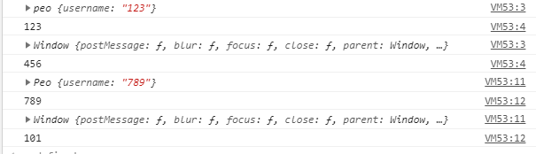

# 面向对象

为了代码优化（方便开发、节省代码），提高性能。

避规过多的全局变量-对象，方法，属性

提高代码的复用性-封装，利用参数传递

## 如何使用面向对象

工场模式、构造函数模式、原型模式、混合模式

### 工场模式

为了解决创建多个相似对象的问题，功能相同的每个方法都要在对象重新创建，内存空间没有得到优化

```js
function people (username, age) {
  var obj = {}
  obj.username = username
  obj.age = age
  obj.handle = function () {
    if (this.age < 20) {
      console.log('少年')
    } else if (this.age > 20 && this.age < 30) {
      console.log('青年')
    } else {
      console.log('中年')
    };
  };
  return obj;
};
var peo = people('a', 40);
peo.handle();
var peo1 = people('b', 20);
peo1.handle();
```

### 构造函数

工场模式的演变，增加new实例化的调用，去除显示定义的对象，使用this代替原有的对象，构造函数默认返回this，不需要return，但与工场模式相同，创建了多个空间进行属性和方法的存储，从而降低了性能。

和工场模式不同，没有显示创建对象，属性和方法赋值给this，没有return

```js
function People(username, age) {
  this.username = username
  this.age = age
  this.handle = function () {
    if (this.age < 20) {
      console.log('少年')
    } else if (this.age > 20 && this.age < 30) {
      console.log('青年')
    } else {
      console.log('中年')
    };
  };
};
var peo = new People('a', 40);
peo.handle()
var peo1 = new People('b', 20);
peo1.handle();
```

```js
function peo(name) {
  this.username = name;
  console.log(this)
  console.log(this.username)
}
var peo1 = new peo('123');
peo('456');

function Peo(name) {
  this.username = name
  console.log(this)
  console.log(this.username)
}
var peo2 = new Peo('789');
Peo('101')

if (peo === Peo) {
  console.log(true)
}
```



## 原型模式

优点：共享原型对象所包含的所有实例属性和方法，多个实例化对象的方式公用了一个空间

缺点，修改一个属性，所有的都修改

```js
function People() {}
People.prototype.name = '123'
People.prototype.showInfo = function () {
  console.log(this)
  console.log(this.name)
}
var peo = new People();
peo.showInfo();
```

## 混合模式

混合模式=构造模式+原型模式

构造模式 ：利用参数为每个对象创建相应属性

原型模式：使实例化后对象的方法共用一个空间

```js
function People(name, age) {
  this.name = name;
  this.age = age
  this.friend = ['1', '2', '3'];
}
People.prototype.showInfo = function() {
  console.log(this.name, this.friend);
};
var peo = new People('a', 11);
var peo2 = new People('b', 12);
peo2.friend.push('4');
peo.showInfo();
peo2.showInfo();
console.log(peo2.showInfo == peo.showInfo)
```

## 制作一个tab切换

```js
function TabSwitch(titId, titEle, conId, conEle, selClass, showClass) {
  // 防止指向错误
  var _this = this;
  // 获取标签
  this.spanArr = document.getElementById(titId).getElementsByTagName(titEle);
  this.divArr = document.getElementById(conId).getElementsByTagName(conEle);
  this.len = this.spanArr.length;

  // 绑定事件
  for (var i = 0; i < _this.len; i++) {
    this.spanArr[i].index = 1;
    this.spanArr[i].onclick = function() {
      // 这边调用switchClass()
      _this.switchClass(this, selClass, showClass);
    };
  };
};
TabSwitch.prototype.switchClass = function (tabObj, sel) {
  // 清空类名
  for (var i = 0; i < this.len; i++) {
    this.spanArr[i].className = '';
    this.divArr[i].className = '';
  }
  this.spanArr[tabObj.index].className = selClass;
  this.divArr[tabObj.index].className = showClass;
};
new TabSwitch('tabTit', 'span', 'tabCon', 'div', 'select', 'show');
```